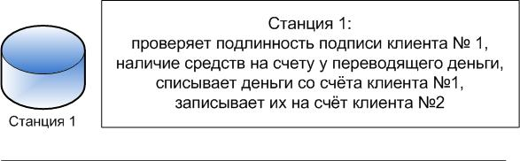
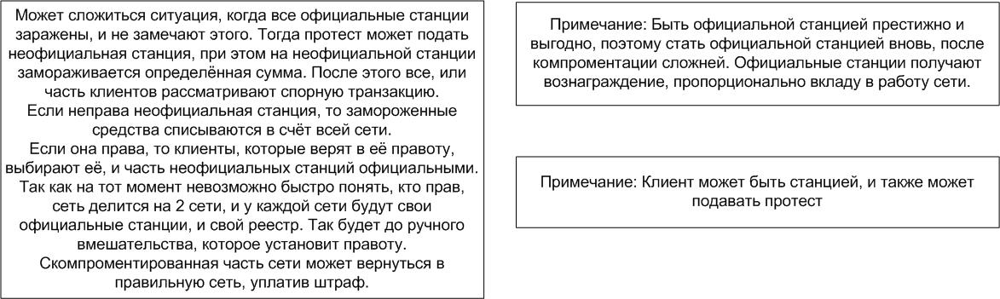

<!DOCTYPE html PUBLIC "-//W3C//DTD HTML 4.01//EN" "http://www.w3.org/TR/html4/strict.dtd">
<html>
<head>
  <meta content="text/html; charset=ISO-8859-1"
 http-equiv="content-type">
  <title>Открытая электронная валюта с высокой скоростью
транзакций</title>
</head>
<body>
 
Доброго времени суток, уважаемые. 
В данной статье я предлагаю разработать децентрализованную электронную
валюту (ДЭВ), с высокой скоростью транзакций, отсутствием накладных
расходов в виде майнинга, открытой архитектурой, и открытым исходным
кодом. 
 
Статья разделена на части: введение, описание принципов, примерный план
разработки. 
 
<b>Введение (если кому не нравится вступление с шутками –
рекомендую пропустить)</b> 
 
Более свободная электронная валюта? (Чем некоторые другие валюты…). 
 
Пока биткоин широкими шагами покоряет массы… Пора сообществу взяться за
новую валюту. Что дал биткоин? Децентрализацию, и некоторую
независимость. Но… У него куча проблем… Большие проблемы с скоростью,
высокие накладные расходы. Сложность внедрения новых возможностей. 
 
Что предлагают последователи? Частичное решение проблем в проекте
каждой команды. Лидера пока нет (и слава Богу!). Сейчас к расхожему
выражению «У меня будет свой блекджек и девушки с пониженной соц.
ответственностью» стоит добавить «и своя криптовалюта» — да, я чуток
намекаю на Павла Дурова. 
 
Каждая команда рождает некоторую идею, пытается раскрутиться, найти
инвесторов, и… счастье есть, никуда больше стремиться не нужно. Дальше
команда (если это не мошенники) пилят код, через некоторое время может
его даже открывают… И… У нас свободная валюта? 
 
Да нет же. Кто будет проверять этот код? Кто будет анализировать? Есть
ли там кривая реализация, есть ли потайные двери, а может архитектор
системы специально предусмотрел чёрный ход, чтобы увести кучу денег в
один прекрасный момент? 
 
Вы бы купили на свои кровные кучу таких монет? Я бы нет… Максимум, я бы
воспользовался ими, чтобы что-то оплатить, если другие деньги пока не
принимают… 
 
Конечно, можно возразить, что при желании можно разобраться в исходном
коде проекта, и проанализировать его. Но кто будет разбираться в коде,
который разрабатывается узкой группой людей? И неизвестно, сколь долго
просуществует система? Ведь если система пишется для небольшой группы,
то время её жизни невелико… 
 
Смысл моих рассуждений – сложно доверять не очень прозрачной системе,
особенно если нет ответственных лиц. 
 
Поэтому – нужен не только исходный код криптовалюты, нужно исходные
документы архитекторов, нужно, чтобы сообщество участвовало в
обсуждении архитектуры проекта. 
Чтобы можно было проверить архитектуру, а при желании написать свой
клиент, сервер.  
Если система даёт возможность написать свой модуль, и включить его в
протокол на определённых условиях — это огромная гибкость. А если в
системе есть тестовый полигон, в котором можно погонять свои решения –
скорей всего в ней будет сложно найти уязвимости! 
 
И только такая архитектура может максимально отвечать запросам
множества людей, а не служить каким-то ограниченным лицам. 
 
Конечно, нужен центр руководства, и опытные архитекторы, которые
помогут не задохнуться проекту от пожеланий пользователей, особенно на
первых этапах. 
 
<b>После вступления, следует задать вопрос, что я предлагаю?</b> 
 
Я предлагаю систему, которая не требует энергозатратных алгоритмов
шифрования, и устойчивость системы от атак поддерживается с помощью
постоянной проверки на правду (правильности транзакций). 
 
<b>Разбиение системы</b> 
 
Система делится на просто пользователей — клиентов, и станции,
официальные, и неофициальные. 
 
 
<b>Проверка правильности транзакций</b> 
Транзакция поступает на одну из официальных станций напрямую от
клиента, или с другого узла.  
 
 
 
 
Если транзакция поступает от клиента напрямую, станция проверяет
подлинность подписи, подписывает транзакцию, и передаёт другим станциям
широковещательно. 
 
&nbsp; &nbsp; &nbsp; &nbsp; &nbsp; &nbsp; 
 
 
 
 
После этого все официальные узлы проверяют и подписывают транзакцию, и
через время протеста она считается прошедшей. 
 
&nbsp; &nbsp; &nbsp; &nbsp; &nbsp; &nbsp;
&nbsp; &nbsp; &nbsp; &nbsp;  
 
&nbsp; &nbsp; &nbsp; &nbsp;  
 
После протеста - Вариант 1: 
 
&nbsp; &nbsp; &nbsp; &nbsp; &nbsp; &nbsp;
&nbsp; &nbsp; &nbsp; &nbsp; &nbsp;  
 
 
После протеста - Вариант 2: 
 
 
 
 
 
 
Одна из неофициальных станций
может тоже может заявить протест, если транзакция подписана неверной
подписью
клиента. Протест принимается в том случае, если на счёте неофициальной
станции есть средства для подачи протеста. Они блокируются, и все узлы
принимают решение, правильная транзакция или нет. Если никто не
поддержал протест, средства с узла списываются, делается отметка о
хакерской атаке с данного узла. После чего узлу станет труднее стать
официальным. Разумеется,
во избежание атаки флудом, за каждый подобный запрос, на счету у
запрашиваемого блокируется определённая сумма. В случае, если запрос
верный, сумма возвращается, и выплачивается бонус. Бонус берётся с
счёта хакерских станций, которые будут платить штраф. 
 
Если часть станций признала транзакцию правильной, часть нет, то
происходит рассылка клиентам спорной транзакции. И сеть делится на 2
части – одна часть признаёт транзакцию правильной, другая неправильной.
Те клиенты, кто считает её правильной, присоединяются к станциям,
которые считаю её правильной. Соответственно, те кто считает её
неправильной – к узлам с соответствующим мнением.  
 
Таким образом отсекается часть сети, которая взломана, и
признаёт неверную транзакцию как верную. 
 
После деления, сеть снова выбирает официальные станции, и продолжает
работу. 
 
Клиенты и станции, которые перешли в противоположную сеть, могут
вернуться, уплатив штраф (в некоторых случаях и без штрафа). 
 
<b>Проверка правильности реестра</b> 
 
На каждой станции хранится как минимум реестр, который описывает,
какими денежными средствами владеют станции и клиенты. 
 
Некоторые станции ведут реестр историй операций. Клиенты хранят только
данные, сколько они имеют средств, либо частично какой-то из реестров
за какое-то время. 
 
Станции сами выбирают, какой алгоритм они используют, чтобы защитить
целостность реестра средств, и реестра истории операций. Протокол сети
позволяет внедрять любой алгоритм защиты реестра как модуль. И любая
станция может использовать любой такой модуль. Некоторые модули
обязательно использовать для защиты реестра. Реестр может храниться в
блокчейне, подписываться множеством станций, станции должны
периодически обмениваться реестрами. 
 
Таким образом станции, при обнаружении подделки реестра, могут убрать
из сети атакующую станцию. 
 
Так как клиент или не хранит полный
реестр, или хранит его часть, он не всегда может однозначно понять,
какая из
сетей правильная, а какая атакующая. Если часть реестра, которую хранит
клиент, позволяет ему идентифицировать правильную сеть, он
присоединяется к правильной сети. Если нет, то клиент присоединяется к
станции, которой доверяет, или по
сложному алгоритму выбирает правильную сеть (Например, правильная сеть
скорее всего больше, в ней больше подписанных транзакций, в ней больше
станций, к которым больше доверия, и
т. д.) 
 
Также, клиент может в любой момент перейти в другую сеть, или
существовать одновременно в нескольких, пока не определит верную.
Критерий верности сети - правильный баланс 
 
<b>Принципы разбиения системы</b> 
 
В сети определённое количество официальных узлов, которые отвечают за
транзакции. Это число узлов будет изменяться от количества транзакций в
сети, и от капитализации сети.  
 
Сеть будет платить этим узлам определённое вознаграждение ежедневно,
которое будет меняться в зависимости от курса электронной валюты. 
 
В сети может быть неограниченное количество станций, отвечающих за
транзакции – любой пользователь сможет поставить себе такой узел. Но
стать официальным он сможет, только если будет иметь на счету
определённую сумму, не очень большую, и подаст заявление на вступление
в официальные узлы. 
 
В случае, если официальный узел прекращает работу на определённое
время, система выбирает случайным образом новый официальный узел из
неофициальных. Причём, вероятность такого выбора для узла выше, чем
больше он находится в сети, чем быстрее работает, чем меньше к нему
было нареканий. 
 
В случае перехода узла в официальные, на его счету блокируется сумма,
которая позволяет ему быть официальным. Потратить эти деньги узел
сможет, только подав заявку на выход из официальных узлов, и после его
выхода из официальных узлов средства разблокируются. 
 
В случае, если узел нарушил определённые правила, он либо исключается
из официальных узлов, либо его средства с заблокированного счёта
списываются полностью или частично, либо происходит и то и другое. В
случае, если правила позволяют узлу отделаться штрафом, и остаться
официальным узлом, для продолжения его работы с его счёта будут списаны
новые средства, до лимита, разрешённого владельцем узла. 
 
В сети есть привилегированные узлы, которые принадлежат разработчику,
они всегда официальные, и не могут потерять этот статус, только если не
окажутся уличёнными в атаке. 
Определённое количество неофициальных узлов получает средства, которые
распределяются между ними случайным образом. Вероятность выиграть
средства для неофициального узла тем выше, чем лучше он работал
(быстрее, без сбоев, без хакерских атак с узла). 
 
Эти средства будут стимулировать пользователей поддерживать сеть
неофициальными узлами. 
 
<b>Зачем нужна подобная организация сети</b> 
 
<ol>
  <li>Сеть подобного рода работает очень быстро. Пользователи
смогут расплачиваться за товары и услуги также, как расплачиваются
банковскими карточками.</li>
  <li>Пользователи могут отрывать свои банки, биржи, обменники
(Про это написано в статье мало, описаны только основные принципы, но
предполагается реализация различных типов валют, смарт контракты и пр.
Возможности обмена валют в реальном времени).</li>
  <li>Не потребуется дорогих станций для майнинга – накладных
расходов будет меньше.</li>
  <li>Благодаря открытости и модульности, сеть можно расширять,
масштабировать. </li>
  <li>Архитектура может разрабатываться сообществом.</li>
</ol>
 
<b>Как предполагается запустить систему</b> 
 
Предполагается, что система будет открытой и свободной, однако, не все
люди готовы работать ради идеи, а для запуска подобного проекта
требуются грамотные специалисты, профессионалы. 
Поэтому, часть средств на оплату специалистов предполагается собрать
через ICO. 
 
<b>Распределение денег</b> 
 
Первоначальное ICO даст деньги на программистов и продвижение
(раскрутку) системы. Будет выпущено ограниченное количество валюты, и
распределено между инвесторами, пропорционально их вкладу.  
 
Часть уйдёт на разработку (год), оставшиеся средства планируется
потратить на продвижение валюты. 
 
Повторное ICO возможно, если курс валюты вырастет более, чем в 2 раза
по отношению к золоту, или закончатся деньги на разработку и
продвижение. 
 
В случае каждой повторной эмиссии, выпускаться будет 2 раза меньше
валюты, чем выпускалось в предыдущий раз. 
 
<b>Что получат инвесторы</b> 
 
Инвесторы получат базовую валюту, которая будет расти в цене.
Предполагается, что будет выпущено много различных типов денег –
деньги, привязанные к нац. валютам – их можно покупать за наличные, и
различные другие типы денег, к примеру — которые обесцениваются с
течением времени, и пр. Но базовая валюта будет одна, и курс её будет
расти постоянно. Её можно будет обменять на любую валюту, и вывести в
наличные. 
 
Кроме этого, инвесторы могут получить инструменты для создания бирж,
банков, гарантийных агентств, и прочих видов бизнеса, в первую очередь,
и напрямую от разработчиков. 
 
<b></b> 
 
 
Ну, и мне кажется правильным название такой системы – TrueCoin, или
FreeCoin. 
 
 
Ответы на вопросы: 
 
1. Если один пользователь А пошлёт одновременно две транзакции
А-&gt;B и A-&gt;C, в каждой из транзакций посылая всю сумму на
счету. Каждую из этих транзакций он подпишет правильной подписью. Одну
из транзакций он отправит на базовую станцию X а вторую на Y. Каким
образом сеть прийдёт к консенсусу по поводу того на чьём счету (B или
C) в конце концов оказались деньги? 
 
С каждым клиентом в один момент работает только 1 ведущая его станция.
Клиент может сменить станцию, но она всё равно в один момент времени
будет только 1. Принцип выбора станции показан на рисунках 
 
2. Все официальные станции проверяют транзакцию [...] они её
подписывают. Где сохраняется эта подпись? 
В реестре станции, в пуле транзакций, которыми обмениваются станции. 
Каждай станция, принимая от клиента подписанную им транзакцию, знает
открытый ключ клиента. Поэтому она доверяет этой транзакции. Другие
станции, принимая реестр, часть реестра, или пул транзакций от станции,
знают её открытый ключ (ключи), и доверяют подписанным закрытыми
ключами данным. 
По сути - подпись нужна, чтобы удостоверить владельца.  
Но, предполагается, что будет несколько протоколов, и возможно
различное хранение реестра, подписанного многими подписями, и пр.
защиты от изменения. Тот же блокчейн, и пр.&nbsp; 
 
3. Мне не кажется такая ситуация интресной — если подпись неправильная
то ни один из участников сети не примет транзакцию (и все
сообщения/блоки её включающие). Скажу по-другому: мне не кажется нужным
иметь специальный механизм для оспаривания самоочевидно невалидных
транзакций. 
 
Этот механизм нужен для исключения атакующих станций, и клиентов из
сети. И на самом деле, не обязательна проверка каждой транзакции, всеми
станциями. Станции могут быть разбиты на блоки, и станции одного блока
будут проверять свой тип транзакций. К примеру, региональный 
 
4. Давайте по шагам: как убедиться, что человек не потратил свой
кошелек два раза? Одну транзакцию послал на один сервер, а другую на
другой. 
 
С каждым клиентом в один момент работает только 1 ведущая его станция.
Ситуация с 2 серверами невозможна 
 
 
 
 
 
 
 
 
 
 
</body>
</html>
